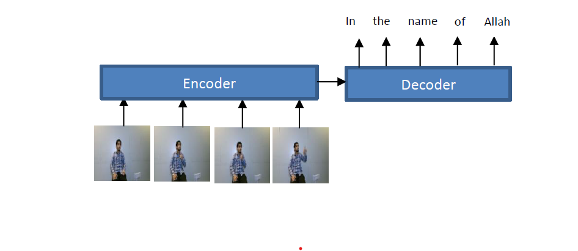

# pytorch_sign_language

Sign language recognition is the task of recognizing the sign performed by deaf people. Sign gestures can be isolated (one sign per video) or continuous (several signs per video). In this repository, the deep learning models for sign language recognition at the sentence level. This task is similar to the video captioning task where the input will be a sign video and the output will be the performed sign(s) by the signer in the text format. An example of the input and output of the system is shown below.

*The data set is a subset of this data set: https://hamzah-luqman.github.io/ArabSign*

*It contains 10 Arabic sentences with corresponding videos, the original dataset contains 50 sentences. To be precise, The data set I am working with is provided as images (video frames) and ground-truth sentences. There are 10 different sentences performed by three signers. There are 80 frames extracted from each video’s sample*

I developed two encoder-decoder models using Pytorch: one without attention and the other with attention. Both models utilized MobileNetV2 to extract features from the frames. Also, I used fasttext for word embeddings. Lastly, I reported the results using word error rate (WER) metric.

You can find the details in the [ Jupyter notebook](sign_language_recognition.ipynb).